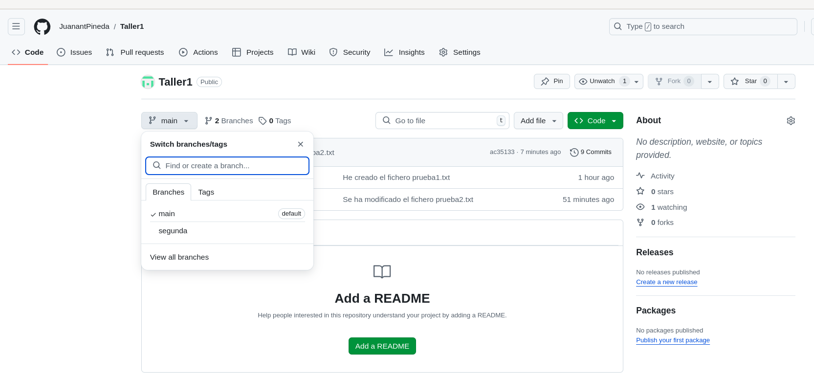

#Prueba de MARKDOWN
##Como poner diferentes elementos en MARKDOWN

Lorem Ipsum *es simplemente el texto* de relleno **de las imprentas y archivos de texto.**
**Lorem Ipsum ha sido el texto de relleno** `estándar de las industrias` desde el año 1500, cuando un impresor (N. del T.

`usuario@debian:~$ git merge segunda`

1. ¿Qué es Lorem Ipsum? 
2. ¿De dónde viene?
3. ¿Por qué lo usamos?

* ¿Qué es Lorem Ipsum?
* ¿De dónde viene?
* ¿Por qué lo usamos?

[Google](https://www.google.com)

[Markdown2](markdown2.md)

| Column 1 | Column 2 | Column 3 |
|----------|----------|----------|
| Row 1    | Cell 2   | Cell 3   |
| Row 2    | Cell 5   | Cell 6   |
| Row 3    | Cell 8   | Cell 9   |
